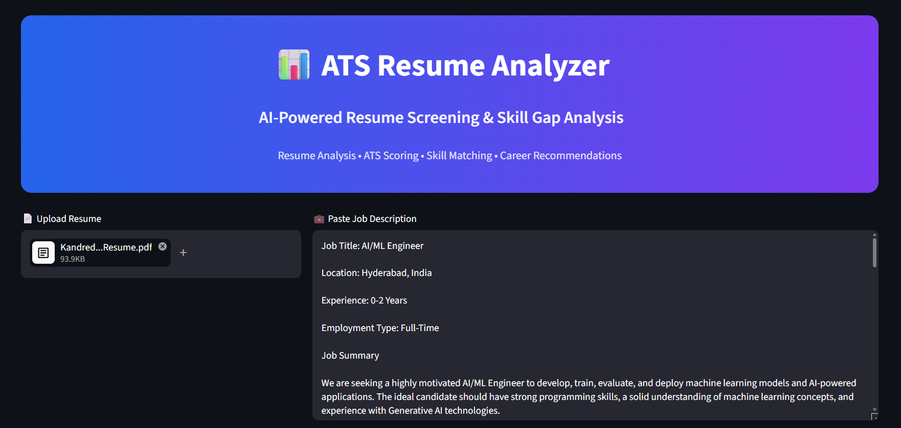
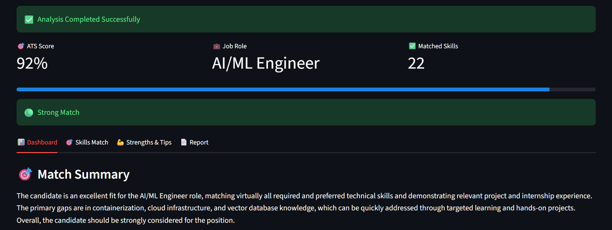
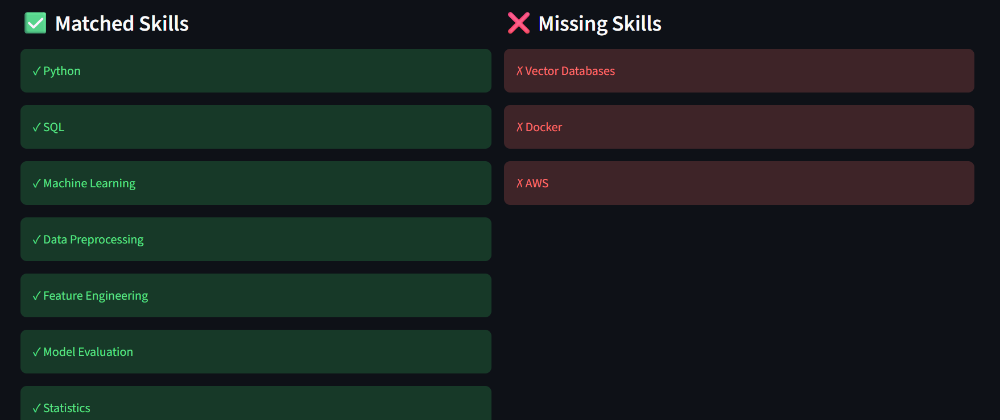
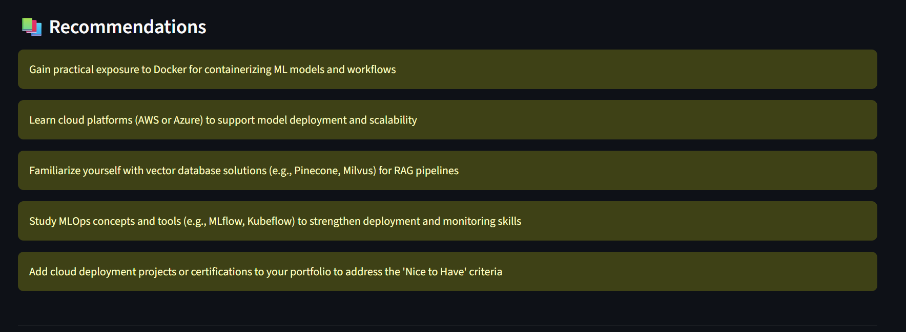

# 📊 ATS Resume Analyzer Using Groq

AI-powered ATS Resume Analyzer that compares resumes with job descriptions, calculates ATS match scores, identifies skill gaps, and provides personalized career recommendations using Groq LLMs, LangChain, and Streamlit.

---

## 🚀 Features

* 📄 Upload Resume (PDF, DOCX, TXT)
* 💼 Analyze Job Descriptions
* 🎯 ATS Match Score Calculation
* ✅ Skill Matching Analysis
* ❌ Missing Skills Detection
* 💪 Candidate Strength Assessment
* 📚 Personalized Recommendations
* 📊 Interactive Dashboard
* 📥 Download Analysis Report
* 🤖 Powered by Groq GPT-OSS-120B

---

## 🛠️ Tech Stack

### Frontend

* Streamlit

### Backend

* Python

### AI & LLM

* Groq
* GPT-OSS-120B
* LangChain

### Document Processing

* PyPDF
* Python-Docx

---

## 📂 Project Structure

```text
ATS-Resume-Analyzer-Using-Groq/
│
├── assets/
│   ├── home_page.png
│   ├── ats_score.png
│   ├── skills_analysis.png
│   └── report_page.png
│
├── app.py
├── utils.py
├── requirements.txt
└── README.md
```

---

## 📸 Application Screenshots

### 🏠 Home Page



---

### 🎯 ATS Score Dashboard



---

### 🛠️ Skills Analysis



---

### 📋 Candidate Assessment Report



---

## ⚙️ Installation

### Clone Repository

```bash
git clone https://github.com/prasadkandreddi/ATS-Resume-Analyzer-Using-Groq.git

cd ATS-Resume-Analyzer-Using-Groq
```

### Create Virtual Environment

```bash
python -m venv venv
```

### Activate Environment

#### Windows

```bash
venv\Scripts\activate
```

#### Linux / Mac

```bash
source venv/bin/activate
```

### Install Dependencies

```bash
pip install -r requirements.txt
```

---

## 🔑 Environment Variables

Create a `.env` file:

```env
GROQ_API_KEY=your_groq_api_key
```

---

## ▶️ Run Application

```bash
streamlit run app.py
```

---

## 📊 Example Output

* ATS Match Score: 92%
* Job Role Identification
* Matched Skills
* Missing Skills
* Candidate Strengths
* Career Recommendations
* Overall Resume Assessment

---

## 🎯 Future Improvements

* Resume Parsing Enhancement
* Multi-Resume Comparison
* PDF Report Generation
* Interview Question Generator
* Job Recommendation Engine
* Resume Improvement Suggestions

---

## 👨‍💻 Author

**Kandreddi Prasad**

GitHub:
https://github.com/prasadkandreddi

LinkedIn:
https://www.linkedin.com/in/kandreddi-prasad-7117952a6

Mail:
kandreddiprasad@gmail.com

---

⭐ If you found this project useful, consider giving it a star.
